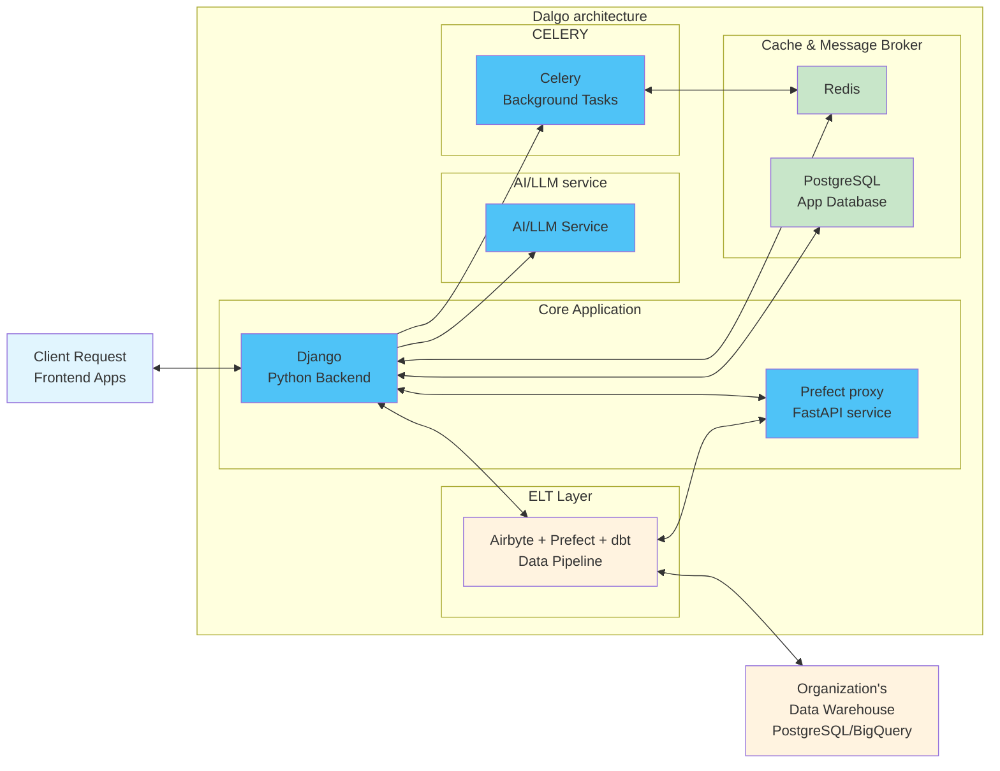

# Dalgo Technical Documentation

## What is Dalgo?

Dalgo is an **open-source Data Platform** specifically designed for NGOs and social sector organizations. Built by Project Tech4Dev, Dalgo democratizes data capabilities by providing an integrated, user-friendly platform that handles the entire data lifecycle from ingestion to visualization.

## Why was Dalgo built?

Many NGOs and social sector organizations collect valuable data but lack the technical resources and infrastructure to effectively manage, transform, and analyze it. Traditional data platforms are often:

- **Too complex** for non-technical teams
- **Too expensive** for smaller organizations  
- **Not designed** for the specific needs of social sector work

Dalgo solves these problems by providing a **complete data platform** that automates data processes, enabling organizations to learn from their data without requiring extensive technical expertise.

## Key Capabilities

- **Multi-tenant Architecture**: Supports multiple organizations with shared infrastructure
- **Data Warehouse Support**: Compatible with PostgreSQL and BigQuery
- **Flexible Data Sources**: Integrates with 100+ data sources via Airbyte
- **SQL-based Transformations**: Uses dbt for data transformation workflows
- **Workflow Orchestration**: Manages complex data pipelines through Prefect
- **User Management**: Role-based access control and organization management
- **Visualization**: Dashboard and chart creation capabilities

## High-Level Architecture



## What These Docs Cover

This documentation provides comprehensive technical information about the **DDP Backend** - the Django-based API server that powers the Dalgo platform.

### Architecture & Design
- System architecture and service interactions
- Database models and relationships
- API design patterns and conventions

### Feature Documentation  
- User management and authentication
- Data pipeline orchestration
- Visualization and dashboard systems
- Integration with external services (Airbyte, Prefect, dbt)

### Developer Guides
- Local development setup
- Testing strategies and best practices
- Deployment and configuration
- Contributing guidelines

## How to Update These Docs

### Prerequisites
- Python 3.10+
- [uv](https://docs.astral.sh/uv/) package manager

### Local Development

1. **Navigate to docs directory:**
   ```bash
   cd docs
   ```

2. **Install dependencies:**
   ```bash
   uv sync
   ```

3. **Start development server:**
   ```bash
   uv run zensical serve
   ```
   
   Docs will be available at http://localhost:10001

### Adding Documentation

1. **Create or edit markdown files** in the `docs/docs/` directory
2. **Follow naming conventions:**
   - Use lowercase with hyphens: `user-management.md`
   - Organize by feature/topic in subdirectories
3. **Update navigation** in `zensical.toml` if adding new sections
4. **Preview changes** using the local development server

### Publishing Changes

1. **Create a pull request** with your documentation changes
2. **CI will automatically build** and validate the docs
3. **After merge to main**, docs are automatically deployed to GitHub Pages

### Writing Guidelines

- Use clear, concise language
- Include code examples where helpful
- Link to relevant source files using the pattern `file_path:line_number`
- Follow the existing structure and style
- Test all code examples before publishing

---

**Target Audience**: Developers, system administrators, and technical contributors working on the Dalgo platform.
